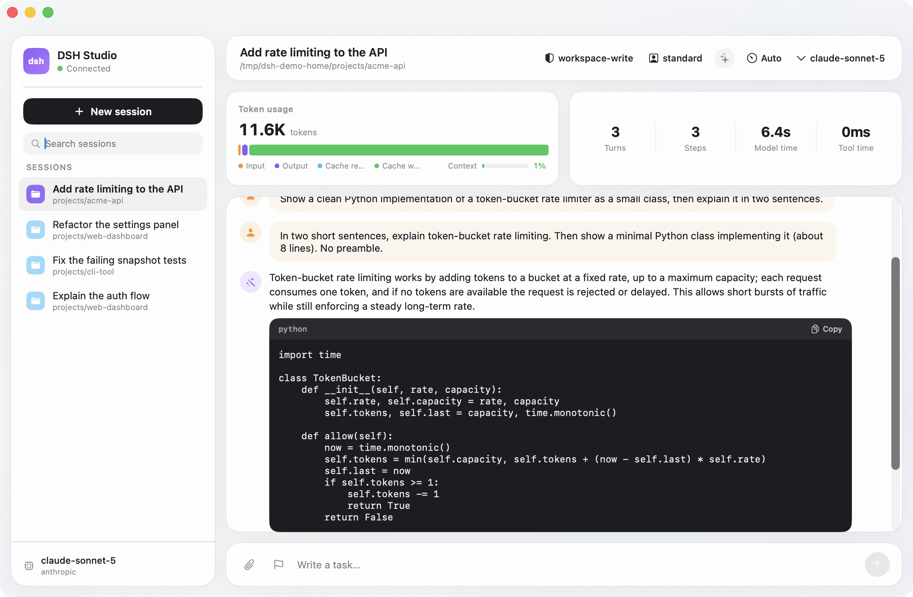

# dsh-studio

A native macOS client for **dsh** — the [`@deepseek-ai/dsh`](https://www.npmjs.com/package/@deepseek-ai/dsh) coding-agent harness. SwiftUI, no Electron, no web view. It talks to a local dsh server over its JSON-RPC surface and a WebSocket event stream, and gives you a real Mac app for driving agent sessions.

> Unofficial and community-built. Not affiliated with or endorsed by DeepSeek. dsh is a separate project with its own license and terms.



▶ [Watch a 15-second demo](docs/demo.mp4)

## Why

dsh ships a capable local agent harness, but the day-to-day surface is a terminal. dsh-studio wraps the same server in a native window: a session list, a live trajectory with streaming text and reasoning, tool calls, approvals, and the session controls (model, reasoning effort, permission mode, presets, goals) as first-class UI instead of slash commands.

## Features

- **Sessions** — list, create (pick a working directory), rename, fork, search.
- **Live trajectory** — streaming assistant text and reasoning, collapsible thinking, tool calls with arguments, and rendered markdown with copy-able fenced code blocks.
- **Model & reasoning** — switch model/provider and reasoning effort per session.
- **Approvals & questions** — respond to tool-approval prompts (with the actual arguments shown) and structured questions inline.
- **Session controls** — permission mode, agent presets, and available skills from the top bar.
- **Settings** — a gear-button panel to enter each provider's API key or token and set the default model, written through dsh's own credential store (`~/.dsh/.credentials.yaml`) so a fresh install needs no shell setup.
- **Goals, jobs, subagents** — set and drive a session goal, watch background jobs, inspect and interrupt subagents.
- **Images** — attach images to a prompt; view image attachments from history.
- **Context & tokens** — token usage breakdown and a context-pressure meter.
- **Metal background** — a lightweight domain-warped gradient that responds to mouse and agent activity, paused when the window is occluded.

## Requirements

- macOS 14 or later
- [dsh](https://www.npmjs.com/package/@deepseek-ai/dsh) installed (`npm i -g @deepseek-ai/dsh`), reachable at `~/.npm-global/bin/dsh`
- Provider credentials for the models you use. Enter them in the app's Settings panel (the gear button), which stores each key in dsh's credential store and applies it on the next request. dsh also reads keys from the env var named by `apiKeyEnv` in `~/.dsh/settings.yaml`; when the app launches its own server it forwards your login-shell environment plus every key in `~/.hermes/.env`, so an existing shell setup keeps working for any provider, not just Anthropic. A key supplied by the environment shows as read-only in the panel, since dsh treats the launching environment as authoritative.
- Xcode and [XcodeGen](https://github.com/yonaskolb/XcodeGen) (`brew install xcodegen`)

## Build & run

```bash
git clone https://github.com/kasparovabi/dsh-studio.git
cd dsh-studio
xcodegen generate
open DshStudio.xcodeproj   # then Run, or:
xcodebuild -scheme DshStudio -configuration Debug build
```

## How it connects

On launch the app probes `http://127.0.0.1:3080`. If a dsh server is already answering there it attaches to it; otherwise it launches its own `dsh web --port <port>` (forwarding your login-shell environment and `~/.hermes/.env` so every configured provider is available) and shuts that child down on quit. Override the port with the `DSH_STUDIO_PORT` environment variable. Requests go to `POST /api/<method>`; events arrive on `ws://127.0.0.1:<port>/api/events.mux`.

## Notes and limitations

- dsh is pre-release; its RPC surface can change between versions, and this client tracks a specific snapshot of it.
- Credentials are taken from your login-shell environment and `~/.hermes/.env`. If you keep keys elsewhere, export them in your shell profile or add them to `~/.hermes/.env`.
- The local dsh API is unauthenticated by design (loopback only); treat it like any other local dev server.
- Single-user, local-first. No telemetry, no accounts.

## License

MIT — see [LICENSE](LICENSE).
